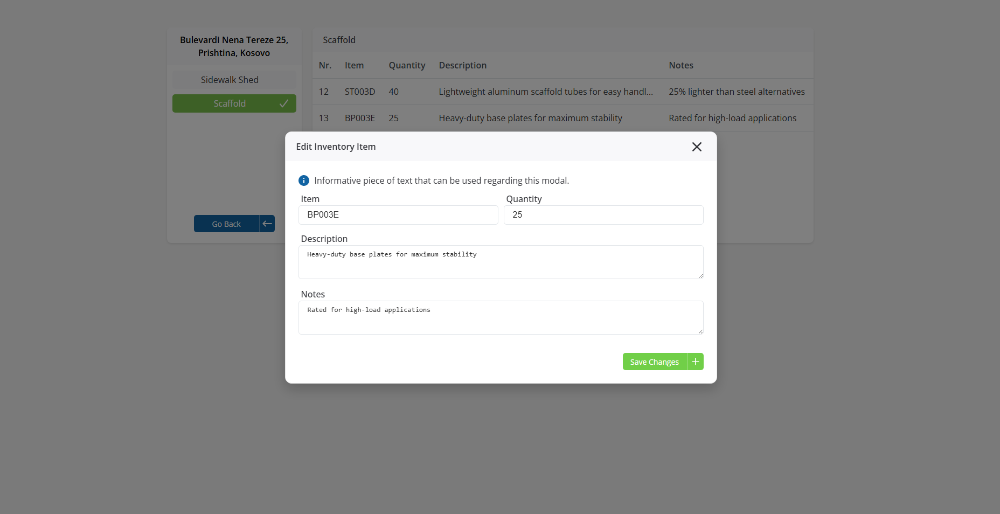

# FBS Jobs - Flex Business Solutions Job Management System

## Features

### Job Site Management
- **Dashboard Overview**: Real-time status tracking with visual indicators for job completion status
- **Job Site CRUD Operations**: Create, read, update, and delete job sites with comprehensive details
- **Status Tracking**: Monitor job sites with statuses including "On Road", "Completed", "On Hold", and "In Progress"
- **Search & Filter**: Advanced search functionality to quickly locate specific job sites
- **Interactive Navigation**: Click-to-navigate system with double-click editing capabilities

### Inventory Management
- **Multi-Category Inventory**: Support for different service categories (Sidewalk Shed, Scaffold, Shoring)
- **Detailed Item Tracking**: Track item numbers, quantities, descriptions, and maintenance notes
- **Service-Based Organization**: Organize inventory by service types with color-coded interface
- **Item Editing**: Comprehensive modal-based editing system for inventory items
- **Visual Data Representation**: Clean tabular display with responsive design

### User Interface & Experience
- **Modern Design**: Clean, professional interface with Google Fonts integration (Open Sans)
- **Responsive Layout**: Mobile-friendly design that works across all device sizes
- **Interactive Components**: Custom buttons, modals, and form controls with consistent styling
- **Accessibility**: Semantic HTML structure with proper ARIA labels and keyboard navigation
- **Visual Feedback**: Status badges, color-coded elements, and intuitive navigation icons

## Visual Showcase

### Job Site Management Interface

*Main dashboard showing job sites with status tracking, search functionality, and quick access to job details*

### Create New Job Site

*Modal interface for creating new job sites with category selection and status assignment*

### Inventory Management

*Inventory management interface showing categorized items with detailed tracking capabilities*

### Edit Inventory Items

*Comprehensive modal for editing inventory items with detailed descriptions and notes*

The application features a clean, modern interface designed for efficient job site and inventory management. The visual design emphasizes clarity and usability with color-coded status indicators, intuitive navigation, and responsive modal dialogs.

## Technical Stack

### Frontend Framework
- **React**: Latest React with hooks and modern patterns
- **React Router DOM**: Client-side routing and navigation
- **Vite**: Fast build tool and development server

### State Management & Forms
- **React Hooks**: useState for local state management
- **Formik**: Form management and validation
- **Yup**: Schema validation for forms

### UI & Styling
- **Custom CSS**: Comprehensive styling with modern CSS features
- **Lucide React**: Modern icon library
- **Google Fonts**: Open Sans font family integration

### Development & Testing
- **ESLint**: Code linting with React-specific rules
- **Vitest**: Fast unit testing framework
- **Testing Library**: React Testing Library for component testing
- **JSDOM**: DOM environment for testing

## Project Structure

```
fbs-jobs/
├── public/
│   └── vite.svg                 
├── src/
│   ├── __tests__/               
│   │   ├── App.test.jsx
│   │   ├── ButtonIcon.test.jsx
│   │   ├── InventoryPage.test.jsx
│   │   ├── InventoryTable.test.jsx
│   │   ├── mockData.test.js
│   │   └── test-utils.jsx
│   ├── assets/                  
│   ├── components/              
│   │   ├── ButtonIcon.jsx       
│   │   ├── InventoryModal.jsx   
│   │   ├── InventoryTable.jsx   
│   │   ├── JobSiteModal.jsx     
│   │   └── SelectInput.jsx      
│   ├── data/
│   │   └── mockData.js          
│   ├── pages/                   
│   │   ├── InventoryPage.jsx    
│   │   ├── JobSitesPage.jsx     
│   │   └── TestPage.jsx         
│   ├── App.css                  
│   ├── App.jsx                  
│   ├── index.css                
│   ├── main.jsx                 
│   └── setupTests.js            
├── eslint.config.js             
├── index.html                   
├── package.json                 
├── vite.config.js               
└── README.md                    
```

## Getting Started

### Prerequisites
- Node.js
- npm or yarn package manager

### Installation

1. **Install dependencies**
   ```bash
   npm install
   ```

2. **Start development server**
   ```bash
   npm run dev
   ```

3. **Open in browser**
   Navigate to `http://localhost:5173`

### Available Scripts

- `npm run dev` - Start development server
- `npm run build` - Build for production
- `npm run preview` - Preview production build
- `npm run lint` - Run ESLint code linting
- `npm run test` - Run test suite
- `npm run test:ui` - Run tests with UI
- `npm run test:run` - Run tests once

## Configuration

### Environment Setup
The application uses Vite as the build tool with the following configuration:
- React plugin for JSX support
- Development server on port 5173
- Hot module replacement (HMR) enabled

### ESLint Configuration
Custom ESLint setup with:
- React-specific rules
- React hooks plugin
- Modern JavaScript standards
- Automatic code quality enforcement

## Data Structure

### Job Sites
```javascript
{
  id: number,
  name: string,
  status: "On Road" | "Completed" | "On Hold" | "In Progress",
  address: string
}
```

### Inventory Categories
```javascript
{
  id: number,
  name: string,
  items: [
    {
      nr: number,
      item: string,
      quantity: number,
      description: string,
      notes: string
    }
  ]
}
```

## Testing

The project includes comprehensive test coverage with:
- **Unit Tests**: Component-level testing for all major components
- **Integration Tests**: Testing component interactions and data flow
- **Mock Data Tests**: Validation of data structure integrity
- **Accessibility Tests**: Ensuring proper ARIA labels and keyboard navigation

Run tests with:
```bash
npm run test
```

## UI/UX Features

### Design Principles
- **Consistency**: Uniform color scheme and typography
- **Accessibility**: WCAG compliant with proper contrast ratios
- **Responsiveness**: Mobile-first design approach
- **User Feedback**: Visual indicators for all user actions


## State Management

The application uses React's built-in state management with:
- **Local State**: Component-level state for UI interactions
- **Props Drilling**: Parent-to-child data flow for shared state
- **Callback Functions**: Event handling and state updates

## Deployment

### Production Build
```bash
npm run build
```

### Build Output
The build process creates optimized files in the `dist/` directory:
- Minified JavaScript and CSS
- Optimized assets
- Service worker ready
- Tree-shaken bundle


## Development Notes

### Code Quality
- ESLint configuration enforces consistent code style
- Pre-commit hooks ensure code quality
- Comprehensive test coverage required for new features

### Performance Considerations
- Lazy loading for route-based code splitting
- Optimized re-renders with React hooks
- Efficient data structures for large datasets

## Browser Support

- Chrome (latest)
- Firefox (latest)
- Safari (latest)
- Edge (latest)


### How might you make this app more secure?
- Use HTTPS/TLS for all communications
- Implement proper input validation and sanitization
- Use parameterized queries to prevent SQL injection

### How would you make this solution scale to millions of records?
- Implement virtual scrolling for large data tables
- Add pagination with cursor-based navigation
- Use lazy loading and code splitting for performance
- Implement client-side caching with service workers
- Add optimistic updates for better user experience


